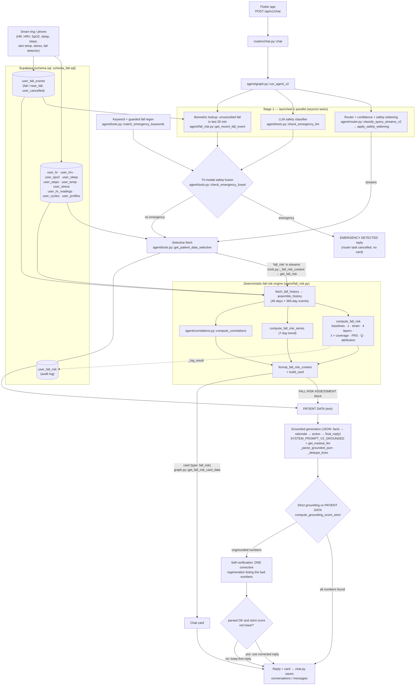

# MedXAI Review-II — Architecture

This document describes what the code does today (branch state at Review-II). Every box names the
file and function that implements it. Numbers that are results live in
[`RESULTS_SUMMARY.md`](RESULTS_SUMMARY.md); formulas live in [`METHODS.md`](METHODS.md).

## 1. End-to-end pipeline (Version D, `agent/graph.py::run_agent_v2`)

Notes on the diagram, all read from the code:

- The router, LLM safety classifier and biometric lookup are started together
  (`asyncio.create_task`). The safety pair is awaited first; the router result is only awaited if no
  emergency fires, and is cancelled otherwise.
- The keyword signal is computed synchronously inside `check_emergency_fused`, so it is shown as a
  direct input to fusion.
- LLM provider (`agent/graph.py::get_medxai_llm`): Groq `openai/gpt-oss-120b` when `GROQ_API_KEY` is
  set, otherwise Mistral `mistral-small-latest`, otherwise OpenAI `gpt-4o-mini`; temperature 0.1 in all
  three. The same client is used for routing, safety classification and generation.
- The fall-risk card is only requested when `fall_risk` is in the routed streams; other streams map to
  the per-vital card builders in `agent/graph.py` (`get_sleep_card_data`, `get_hr_card_data`, …).
- `get_fall_risk` caches results per user and date for 60 s (`_CACHE_TTL_S`), so the context block
  and the card normally share one computation.
- After the reply is final, `compute_grounding_score` (the looser Review-I metric that also accepts
  numbers from the model's own `facts` list) is computed for logging only.

### Baseline versions used in the evaluation (`run_fall_evaluation.py`)

| Version | Function | What it does |
|---|---|---|
| A | `agent/graph.py::run_agent_a` | One LLM call, generic system prompt, no data |
| B | `agent/graph.py::run_agent_b` | `search_medical_knowledge` RAG context + one LLM call, no biometrics |
| C | `agent/graph.py::run_agent` | Keyword-only emergency check (`check_emergency`), fetch-all `get_patient_data` (includes the fall-risk block), one LLM call, no verification |
| D | `agent/graph.py::run_agent_v2` | The pipeline above |

## 2. The five novelty contributions

### 2.1 Tri-modal safety fusion — `agent/tools.py::check_emergency_fused`

Three independent signals decide whether a message is an emergency:

1. **Keyword** — `match_emergency_keywords`: substring vocabulary `EMERGENCY_KEYWORDS` (cardiac,
   stroke, breathing, self-harm, and fall phrases such as "can't get up", "hit my head", "passed out")
   plus two guarded regexes in `FALL_PATTERNS`: a first-person fall ("I fell", "I've fallen", "I had a
   fall") with a negative look-ahead for benign continuations ("asleep", "behind", "in love", "ill",
   …), and "on/lying on the … floor".
2. **LLM** — `check_emergency_llm`: JSON `{is_emergency, confidence, reason}`; counts as triggered only
   when `is_emergency` and `confidence ≥ 0.7`.
3. **Biometric** — `agent/fall_risk.py::get_recent_fall_event`: any `user_fall_events` row with
   `event_type = 'fall'`, `user_cancelled = false`, detected in the last 30 minutes.

Fusion rule: `emergency = keyword_effective OR llm_triggered OR biometric_triggered`, where a keyword
hit is **overridden** (ignored) only when the LLM says "not an emergency" with confidence ≥ 0.85 (this
suppresses informational questions such as "What are the symptoms of a stroke?"). The biometric signal
cannot be overridden: a calm message ("I'm fine, just a bit shaken") still escalates, with a softer
message that tells the user to cancel the alert if safe.

### 2.2 Compute-then-explain with closed-loop grounding — `agent/fall_risk.py` + `agent/graph.py::run_agent_v2`

- **Compute:** the fall-risk score is produced by the deterministic engine
  (`compute_fall_risk`), never by the LLM. `format_fall_risk_context` renders every number as a
  literal string and instructs the model not to recompute it; `SYSTEM_PROMPT_V2_GROUNDED` adds the
  FALL RISK RULES (quote verbatim, explain only through listed contributors, never say the user *will*
  fall, disclose low confidence / stale data).
- **Explain:** the LLM returns JSON `facts → rationale → action → final_reply`.
- **Closed loop:** `compute_grounding_score_strict` extracts every number in `final_reply` (regex
  `\d+(?:\.\d+)?`), ignores the allow-list `{"112"}`, and checks each against PATIENT DATA only, with
  digit boundaries so "5" is not found inside "56". If any number is ungrounded, one corrective turn is
  sent that lists the offending numbers; the corrected reply is used only if it parses and its strict
  score is not lower. At most one retry.

### 2.3 Evidence-derived layer weights — `agent/fall_risk.py::EVIDENCE_RATIOS`, `BASE_LAYER_WEIGHTS`

Layer weights are not tuned: λ_L = ln(ratio_L) / Σ ln(ratio), with the published ratios in the code
comments — fall history OR 2.8 and gait problems OR 2.1 (Deandrea et al., *Epidemiology* 2010),
orthostatic hypotension OR 1.73 (meta-analysis, *JAMDA*), poor sleep RR 1.27 (SWAN cohort,
*Innovation in Aging* 2024). This gives FH 0.40, MO 0.29, P 0.21, RC 0.09 (see
`RESULTS_SUMMARY.md` §1). At run time each λ is multiplied by that layer's data coverage and
renormalised (adaptive weighting), so missing sensors do not silently count as "no risk".

### 2.4 Cycle-aware baselines — `agent/fall_risk.py::cycle_phase`, `compute_fall_risk`

For users whose profile gender starts with "f" and who have cycle logs (`_cycle_eligible`), the
baseline for HRV, resting HR and skin temperature (`PHYSIO_CYCLE_FEATURES`) is built from same-phase
history days only (phase-matched, ≥ 5 days). If too few same-phase days exist and today is luteal,
literature offsets are applied instead (`LUTEAL_OFFSETS`: temp +0.3 °C, resting HR +2 bpm, HRV −7 %).
The engine also recomputes the score without correction so the explanation can say what the
correction changed (`cycle.frs_without_correction`). Effect on the demo cohort:
`RESULTS_SUMMARY.md` §3.

### 2.5 Safety-asymmetric routing — `agent/router.py::apply_safety_widening`

The LLM router returns `{streams, confidence, safety_relevant}` (`_parse_router_output` also accepts
the older plain-list format with confidence 0.9). If the router fails, `fallback_keyword_router` is
used with confidence 0.5 and safety relevance comes from `keyword_safety_relevant` (first-person
pronoun + a word from `SAFETY_KEYWORDS`). Then:

- safety-relevant **and** confidence < 0.75 → union with `SAFETY_STREAMS`
  (`fall_risk`, `current_hr`, `spo2`, `hrv`);
- safety-relevant **and** confidence ≥ 0.75 → add `fall_risk` if missing;
- not safety-relevant → streams unchanged.

The asymmetry is deliberate: an unnecessary fetch costs latency, a missed fetch on a safety question
costs recall.

## 3. Motion-layer signal processing (offline validation only)

`agent/gait_features.py` (v1, v2, v3 feature extractors and label-free Gait Instability Indices) is
validated on PhysioNet LTMM lab walks by `run_ltmm_validation.py` (Exp 1) and
`run_ltmm_experiment2.py` (Exp 2). It is **not** called by the chat backend: the backend Motion layer
uses daily steps and near-fall events (see `METHODS.md` §1 and Limitations).
Experiment 3 (`run_ltmm_daily.py`) applies the same v2 extractor to walking bouts detected in the
3-day free-living recordings by `agent/daily_gait.py` (`walking_windows`, `detect_bouts`,
`daily_features_for_chunks`); see `METHODS.md` §2.6.
