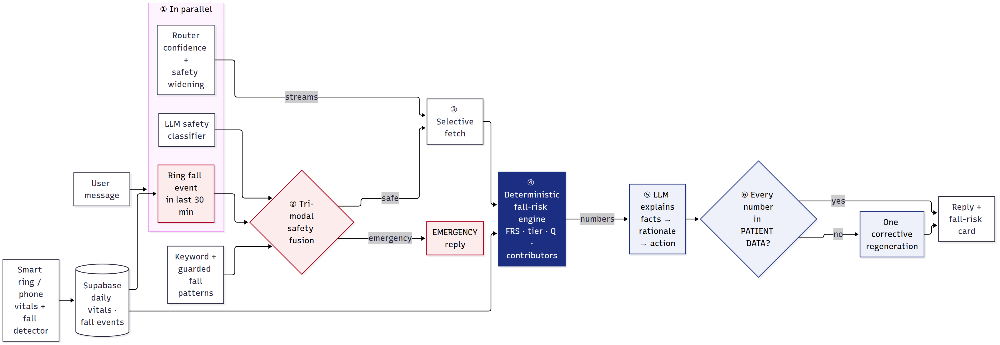
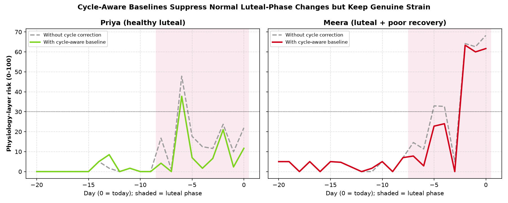
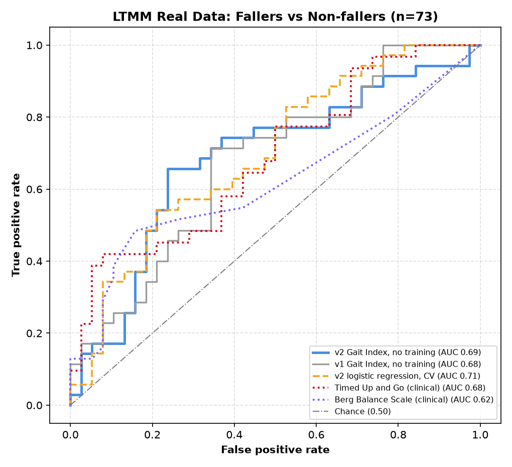
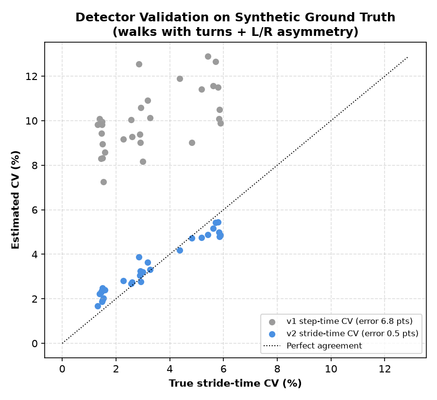
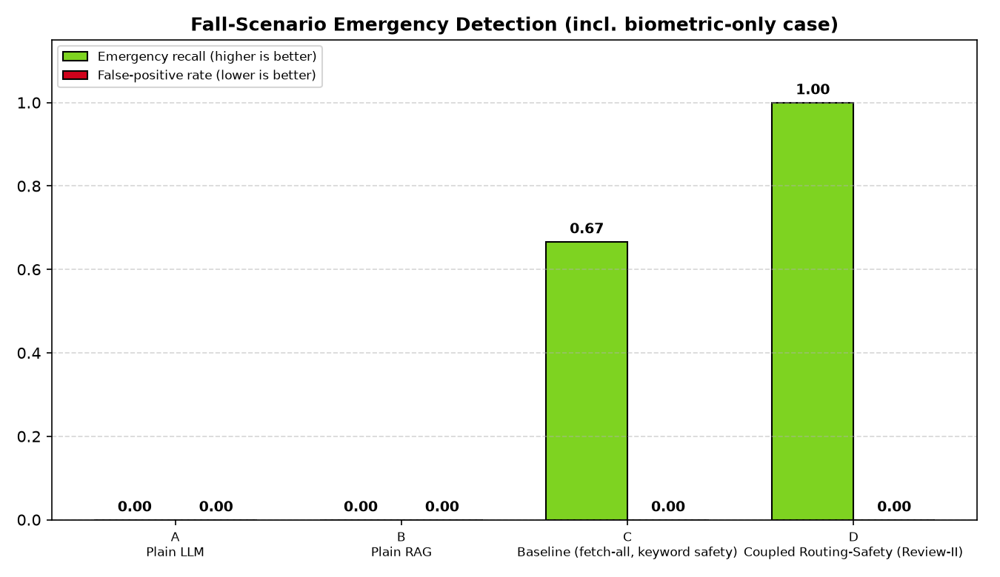
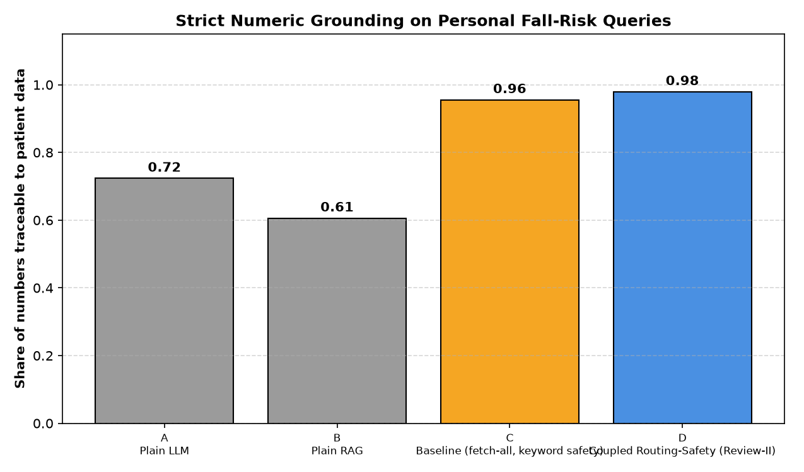
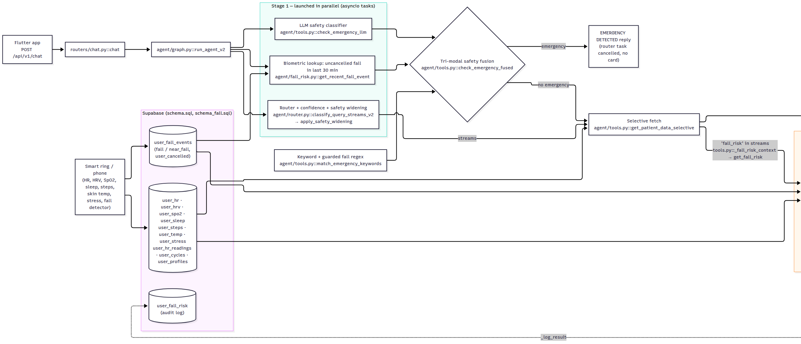
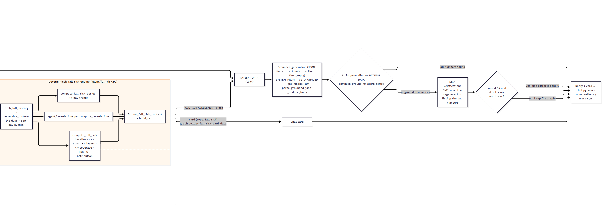

# MedXAI — Review-II slides

_Generated by `scripts/build_review2_deck.py` from the results files; do not edit by hand. Numbers and their sources: [`NUMBERS.md`](NUMBERS.md)._

## Slide 1 — MedXAI: Explainable, Safety-Aware Fall-Risk Prediction from Smart-Ring Data

- Student Name(s): Name — Reg. No. _(template placeholder)_
- Guide: Dr. Guide Name, School _(template placeholder)_
- Guide's signature with date _(template placeholder)_
- Programme / School: B.Tech — SENSE, VIT Chennai
- Review & Date: Review-II · 30.09.2026 (Wednesday)

**Speaker notes:**

Title slide. Names, register numbers, guide and the guide's signature are left as the template's placeholders: fill them in, get the signature, scan this slide and keep the scan as slide 1.

---

## Slide 2 — Introduction & Problem Recap

**Problem recap**
- Fall systems detect a fall after it happens; they do not predict or explain risk
- Health chatbots state health numbers they cannot be trusted with
- Text-only safety checks miss a fallen user who types “I'm fine”
**Objectives**
- Predict daily fall risk from ring data with a deterministic, explainable engine
- Let sensors, engine and LLM check each other before anything reaches the user
- Validate on real data against a clinical gold standard (Timed Up and Go)

**Speaker notes:**

Open with the hook. An elderly woman falls at home. Her ring detects the fall. A minute later she types “I'm fine, just a bit shaken”. A text-only assistant reads that and tells her she is fine. Ours does not: the ring's fall event overrides the calm text and the reply is an emergency message. I will prove that live at the end (demo, step 3), and it is scenario 7 in our evaluation, where only Version D caught it.

The problem has three parts: existing fall systems react after the fall; chatbots are not trustworthy with health numbers; and safety checks only read text. Our objectives follow directly: an explainable deterministic fall-risk engine, an agent where sensors, engine and LLM check each other, and real-data validation against the clinical Timed Up and Go test.

---

## Slide 3 — Refinements after Review-I Feedback

| Promised / requested at Review-I | Delivered | Where |
|---|---|---|
| Trend-deviation signal-processing layer | Personal median/MAD baselines, z-score deviations, dead-zone strain | agent/fall_risk.py |
| Self-verification loop | Strict number check vs patient data + one corrective regeneration | agent/graph.py |
| Personal correlation detection | Pearson r on the user's own history (n ≥ 14, |r| ≥ 0.4, p < 0.05) | agent/correlations.py |
| Router confidence scoring | Confidence + safety-asymmetric widening of the data fetch | agent/router.py |
| Safety-critical application | Fall prediction: fall-risk score, fall events, fall card | agent/fall_risk.py, graph.py |
| Deeper signal processing (guide) | Gait pipeline v2: turn removal, McCamley contacts, stride CV | agent/gait_features.py |

**Speaker notes:**

All four modules promised at Review-I are delivered, each with offline unit tests: the trend-deviation signal-processing layer, the self-verification loop, personal correlation detection and router confidence scoring. Following the feedback, we chose fall prediction as the safety-critical application, and, as our guide asked, we went deeper into signal processing: a gait pipeline validated on real IMU data (PhysioNet LTMM), shown in the results.

---

## Slide 4 — Literature Review (1/3): Review-I Papers

| No. | Author(s) & Year | Title / Source | Method / Approach | Findings & Research Gap |
|---|---|---|---|---|
| 1 | {{Review-I paper 1}} |  |  |  |
| 2 | {{Review-I paper 2}} |  |  |  |
| 3 | {{Review-I paper 3}} |  |  |  |
| 4 | {{Review-I paper 4}} |  |  |  |
| 5 | {{Review-I paper 5}} |  |  |  |
| 6 | {{Review-I paper 6}} |  |  |  |
| 7 | {{Review-I paper 7}} |  |  |  |
| 8 | {{Review-I paper 8}} |  |  |  |
| 9 | {{Review-I paper 9}} |  |  |  |
| 10 | {{Review-I paper 10}} |  |  |  |

_Papers 1–10: the ten Review-I papers (to be pasted). Papers 11–22: added for Review-II._

**Speaker notes:**

The ten papers from Review-I stay in the table; they covered health agents, RAG and grounding. Kriti will paste them here and in the references.

---

## Slide 5 — Literature Review (2/3): Fall Risk & Gait

| No. | Author(s) & Year | Title / Source | Method / Approach | Findings & Research Gap |
|---|---|---|---|---|
| 11 | Deandrea et al., 2010 | Risk factors for falls in community-dwelling older people / Epidemiology | Systematic review + meta-analysis | History of falls OR 2.8, gait problems OR 2.1. Gap: population-level risk, no personal daily trend |
| 12 | Hausdorff et al., 2001 | Gait variability and fall risk… 1-year prospective study / Arch Phys Med Rehabil | Prospective cohort, stride-time variability | Stride-time variability predicts future falls. Gap: lab measurement, not continuous wearable |
| 13 | [TO VERIFY: authors], JAMDA | Orthostatic hypotension and falls meta-analysis / J Am Med Dir Assoc | Meta-analysis | Orthostatic hypotension OR 1.73 for falls. Gap: one-off BP test, not daily physiology |
| 14 | SWAN [TO VERIFY: authors], 2024 | Sleep and falls (SWAN cohort) / Innovation in Aging | Cohort study | Poor sleep RR 1.27 for falls. Gap: questionnaire sleep, not ring-measured |
| 15 | Mishra, Snyder et al., 2020 | Pre-symptomatic detection of COVID-19 from smartwatch data / Nat Biomed Eng | Personal-baseline deviation detection | Deviations from a personal baseline flag illness early. Gap: not falls, no explanation |
| 16 | [TO VERIFY: authors], 2022 | Oura ring across the menstrual cycle / Int J Women's Health | Ring skin temperature, HR, HRV by cycle phase | Luteal phase shifts temperature and resting HR. Gap: not used in risk baselines |

_[TO VERIFY] = bibliographic detail still to be checked against the paper._

**Speaker notes:**

Rows 11–14 give the evidence for our layer weights (fall history, gait, orthostatic hypotension, sleep). Row 15 is the personal-baseline idea. Rows 16–17 motivate cycle-aware baselines.

---

## Slide 6 — Literature Review (3/3): Fall Risk & Gait

| No. | Author(s) & Year | Title / Source | Method / Approach | Findings & Research Gap |
|---|---|---|---|---|
| 17 | [TO VERIFY], 2026 | Wearable HRV across the menstrual cycle: living systematic review / Sports Med | Living systematic review | HRV varies with cycle phase. Gap: wearable scores ignore phase |
| 18 | Askhatova et al., 2026 | [TO VERIFY: title] / MethodsX | Temporal CNN on LTMM, subject-wise CV | AUC 0.749 using 1-min + 3-day data + demographics. Gap: black box, no explanation |
| 19 | Weiss et al., 2013 | Gait quality during daily life and fall risk (3-day recordings) / Neurorehabil Neural Repair | LTMM study: 3-day lower-back accelerometer | Daily-life gait differs in fallers. Gap: no personal agent or explanation |
| 20 | McCamley et al., 2012 | Initial and final contact from lower-trunk inertial data / Gait & Posture | Gaussian-derivative initial-contact detection | Accurate step timing from one trunk IMU. Gap: detection only |
| 21 | Moe-Nilssen & Helbostad, 2004 [TO VERIFY] | Gait cycle characteristics by trunk accelerometry / J Biomech | Autocorrelation step/stride regularity | Regularity from one sensor. Gap: method only, no risk model |
| 22 | Drover et al., 2017 | Faller classification from turn and straight-walking features / Sensors | Turn vs straight-walking accelerometer features | Turn features help classify fallers. Gap: not replicated on our data |

_[TO VERIFY] = bibliographic detail still to be checked against the paper._

**Speaker notes:**

Rows 18–22 are the gait and LTMM papers. Askhatova 2026 is the fair comparison for our LTMM results because it also uses subject-wise cross-validation. McCamley and Moe-Nilssen are the signal-processing methods we implemented. Drover 2017 motivated our turn features; on our data they did not help (Experiment 2, model M1).

---

## Slide 7 — Research Gaps Identified

| Gap in existing work | How MedXAI addresses it |
|---|---|
| Fall systems detect falls but do not predict or explain risk | Daily fall-risk score with per-feature contributions |
| Best fall-risk models are black boxes | Deterministic engine; the LLM only explains its numbers |
| Health agents check safety from text only | Tri-modal fusion: keyword + LLM + ring fall event |
| No cycle-aware baselines in wearable risk scores | Phase-matched baselines for HRV, resting HR, temperature |

**Speaker notes:**

Four gaps come out of the literature, and each maps to one of our contributions on the next slide.

---

## Slide 8 — Novelty: Existing → Ours → Proof

| Contribution | Existing | Ours | Proof (our data) |
|---|---|---|---|
| 1. Tri-modal safety fusion | Keyword or LLM reads the text only | Keyword + LLM + ring fall event (last 30 min), fused | Emergencies caught: D 3/3 (incl. biometric-only), C 2/3, A 0/3, B 0/3 |
| 2. Compute-then-explain, closed-loop grounding | LLM generates health numbers | Engine computes; LLM explains; every number checked, one corrective retry | Strict grounding D 0.979 vs A 0.723, B 0.606; self-verification 0.80 → 1.00 |
| 3. Evidence-derived weights | Hand-tuned or learned black-box weights | λ ∝ ln(published risk ratio), renormalised by coverage | FH 0.402 (OR 2.8), MO 0.290 (OR 2.1), P 0.214 (OR 1.73), RC 0.093 (RR 1.27) |
| 4. Cycle-aware baselines | One baseline for every day | Phase-matched baseline for HRV, resting HR, temperature | Healthy luteal user: physiology risk 18.1 → 10.2; strained user: flagged days 2 → 0 |

_Additional safeguard (unit-tested): safety-asymmetric routing. It did not fire in the evaluation (router confidence 0.90–0.99)._

**Speaker notes:**

Four core contributions, each with proof from our own results files.
1. Tri-modal safety fusion: in 11 scenarios with 3 emergencies, D caught 3/3, including scenario 7, where the text was calm and only the ring's fall event showed the emergency; the LLM classifier did not flag it. C caught 2/3; A and B caught 0/3 and 0/3. No version raised a false alarm (D 0/8).
2. Compute-then-explain: strict grounding is the share of numbers in a reply that appear in the user's real data, on personal queries. D 0.979, C 0.955, A 0.723, B 0.606. Self-verification fired 1/11 times and fixed that reply from 0.80 to 1.00.
3. Weights: λ is proportional to the natural log of published odds/risk ratios, so fall history counts most. No training data needed; the ratios come from different studies, which we state as a limitation.
4. Cycle-aware baselines: for the healthy luteal user, mean physiology-layer risk on 9 normal luteal days drops from 18.1 to 10.2; for the strained user, days flagged at ≥ 30 drop from 2 to 0 while her genuine acute strain days stay high. Honest caveat: for the healthy user one day stays flagged (1 → 1).
Safety-asymmetric routing is an extra safeguard. It did not fire in the evaluation because the router was confident (0.90–0.99), so we only claim it through unit tests.

---

## Slide 9 — System Design & Architecture

- **Engine computes:** Scores come from agent/fall_risk.py, never from the LLM
- **LLM only explains:** Every number is checked against patient data before sending
- **Ring can override chat:** An uncancelled ring fall event (last 30 min) forces an emergency reply



**Speaker notes:**

The request goes through six stages. (1) Router, LLM safety classifier and the ring fall-event lookup run in parallel. (2) Tri-modal fusion decides if this is an emergency; if so we reply immediately. (3) Otherwise we fetch only the data streams the router selected. (4) The deterministic engine computes the score, tier, confidence and contributors. (5) The LLM explains those numbers as facts, rationale and action. (6) Every number in the reply is checked against the patient data; if one is missing we regenerate once. Three things to remember: the engine computes, the LLM only explains, and the ring can override the chat. The full function-level diagram is the backup slide at the end and in docs/ARCHITECTURE.md.

---

## Slide 10 — Implementation (1/2): Fall-Risk Engine

**Personal baseline and deviation**
- Median / MAD of the previous 28 days (≥ 7 days)
- z = (today − median) / (1.4826·MAD), in the risk direction
- Strain 0–100: dead zone below z = 0.5, full at z = 3
**Four layers → score**
- Layer risk = weighted mean strain of its features
- FRS = Σ λ′_L · risk_L,  λ′_L = λ_L·c_L / Σ λ_j·c_j  (c = data coverage)
- Tier: LOW < 40 ≤ MODERATE < 70 ≤ HIGH; contributions add up to FRS

| Layer | Ratio | ln | λ |
|---|---|---|---|
| Fall history | OR 2.8 | 1.030 | 0.402 |
| Motion (gait) | OR 2.1 | 0.742 | 0.290 |
| Physiology (OH) | OR 1.73 | 0.548 | 0.214 |
| Recovery (sleep) | RR 1.27 | 0.239 | 0.093 |

_λ = ln(ratio) / Σ ln(ratio). Sources: Deandrea 2010 [11], JAMDA [13], SWAN [14]._

**Speaker notes:**

Every feature (HRV, resting HR, SpO2, skin temperature, sleep duration and score, stress, steps) is compared with the user's own robust baseline: median and MAD over the previous 28 days. The z-score goes through a dead zone so normal day-to-day noise adds nothing, and saturates at z = 3. Layers average their features' strain; the four layers are combined with evidence weights λ, renormalised by how much data each layer actually has (coverage), so a missing sensor is not silently read as 'no risk'. Because the score is a weighted sum, each feature's contribution in points adds up exactly to the score, which is what the LLM is allowed to explain. Weights: fall history 0.402, motion 0.290, physiology 0.214, recovery 0.093. Exact formulas: docs/METHODS.md §1.

---

## Slide 11 — Implementation (2/2): Gait & Safety Fusion

**Gait pipeline v2 (lower-back IMU, 100 Hz)**
- Band-pass 0.5–15 Hz; remove turns (yaw > 25 °/s ± 1 s)
- Initial contacts: McCamley method, person-specific step period
- Reject intervals outside 0.6–1.5 × median
- Stride-time CV, step/stride regularity, harmonic ratio, cadence
- Untrained index: mean of direction-signed z-scores, no labels used

```python
def check_emergency_fused(message: str,
        llm_res: tuple[bool, str, float],
        biometric_event: dict | None = None
        ) -> tuple[bool, str, dict]:
    ...
    # Third signal (Review-II): physiological evidence
    # independent of the text. An uncancelled fall detected
    # by the ring/phone in the last 30 minutes escalates
    # ANY message, even a calm-sounding one ("I'm fine").
    biometric_triggered = bool(biometric_event)

    is_emergency = bool(effective_kw_triggered) \
        or llm_triggered or biometric_triggered
```

_agent/tools.py · check_emergency_fused (excerpt)_

**Speaker notes:**

The guide asked for deeper signal processing. Version 1 of the gait detector gave implausibly high variability, so version 2 removes turns using the gyroscope, detects initial contacts with the McCamley method, rejects implausible intervals and uses stride-time CV as in Hausdorff 2001. Every threshold is in docs/METHODS.md §2. On the right is the core of the safety fusion: an uncancelled ring fall event in the last 30 minutes is enough on its own to make the reply an emergency, whatever the text says.

---

## Slide 12 — Results & Analysis (75%): Engine

**Cycle-aware ablation**
- Healthy luteal: risk 18.1 → 10.2 (9 days, −43.4%)
- Strained luteal: 19.3 → 11.5; flags 2 → 0
- Genuine acute strain is kept (last 3 days stay high)
- Synthetic cohort: shows the engine behaves as designed

| User (synthetic) | FRS | Tier | Q | Note |
|---|---|---|---|---|
| Arun (low risk) | 6 | LOW | 100% |  |
| Meera (luteal + poor recovery) | 47 | MODERATE | 100% | cycle-aware; 48 without |
| Ravi (stale data) | 3 | LOW | 70% | data flagged STALE |
| Lakshmi (recent fall) | 71 | HIGH | 100% |  |
| Priya (healthy luteal) | 4 | LOW | 100% | cycle-aware; 6 without |



**Speaker notes:**

5 synthetic demo users, 35 days each, generated with fixed seeds (engine run dated 2026-09-27). The tiers come out as designed: the recent-faller is HIGH, the luteal user with poor recovery MODERATE, the others LOW. The stale user is flagged and her coverage drops to 70%. The chart is the cycle-aware ablation: grey is without correction, colour with. Normal luteal changes are suppressed, but the strained user's real acute strain stays high. This is synthetic data, so it demonstrates correct behaviour, not clinical accuracy; that is what the next slide is for.

---

## Slide 13 — Results: Real-Data Validation (LTMM)

- n = 73 (35 fallers, 38 non-fallers); TUG/Berg on 69
- Detector error 6.79 → 0.52 CV points (r 0.61 → 0.98)
- Real data: stride CV median 8.36% → 3.00%

| Faller vs non-faller | AUC |
|---|---|
| v2 gait index, untrained | 0.686 |
|   95% CI | 0.561–0.808 |
| Timed Up and Go | 0.683 |
| Berg Balance Scale | 0.618 |
| Cadence alone (v2) | 0.770 |





**Speaker notes:**

This is real data: 73 older adults from PhysioNet LTMM, one-minute lab walks with a lower-back IMU, labelled by fall history (35 fallers). Our untrained v2 gait index reaches AUC 0.686 (95% CI 0.561–0.808), with no training on labels. The clinical gold standard, Timed Up and Go, gets 0.683 on the 69 subjects who have it, and our index on those same subjects gets 0.684. So: comparable to the clinical test, not better; the confidence intervals overlap. Berg is 0.618. The small chart is the synthetic ground-truth bench: v1 overestimated variability by 6.79 points, v2 by 0.52 (correlation with truth 0.61 → 0.98). On the real walks, median variability fell from 8.36% (implausible) to 3.00%. Caveats: labels are retrospective, and the sensor is on the lower back, not a ring.

---

## Slide 14 — Results (contd.): Rigor

- Pre-registered, every model reported: more features and complex models did not beat M0
- Daily-life gait did not improve on the same subjects: best D3 0.650 vs lab M0 0.655
- Cadence is the consistent marker: lab AUC 0.770, daily life 0.659
- Askhatova 2026: 0.749 with 3-day data + deep network (black box)

| Exp 2 | Lab walks, n = 73, pre-registered | AUC |
|---|---|---|
| M0 | v2 Gait Index (untrained) | 0.686 |
| M1 | v3 Index: gait + turns (untrained) | 0.634 |
| M2 | LogReg: v2 features | 0.721 |
| M3 | LogReg: v3 gait + turns (k=8) | 0.661 |
| M4 | LogReg: v3 + age + sex (k=8) ★ | 0.651 |
| M5 | RandomForest: v3 gait + turns | 0.593 |
| M6 | RandomForest: v3 + age + sex | 0.586 |

| Exp 3 | Daily life, 3-day recordings | n | AUC |
|---|---|---|---|
| M0 | Lab v2 index, same subjects (reference) | 64 | 0.655 |
| D0 | Daily-life index (untrained) | 71 | 0.587 |
| D1 | Combined lab + daily index (untrained) ★ | 64 | 0.636 |
| D2 | LogReg: daily features | 71 | 0.519 |
| D3 | LogReg: lab + daily (k=6) | 64 | 0.650 |

_★ primary model. Trained models: mean over 20×5 subject-wise CV._

**Speaker notes:**

We tried hard to beat our own number, with the protocol fixed in advance. Experiment 2: seven models on the lab walks. The untrained v2 index M0 scores 0.686. Adding turn features (M1) gives 0.634. The best trained model is logistic regression on the five v2 features, M2, 0.721 ± 0.019. The pre-registered primary, M4, gets 0.651; its permutation test is p = 0.030 on a single split. Random forests get 0.593 and 0.586: more complexity did worse on 73 subjects. Experiment 3: daily-life walking from the 3-day recordings. The primary combined index D1 gets 0.636 (permutation p = 0.030), below the lab index on the same 64 subjects (0.655). Daily-life alone: D0 0.587, D2 0.519. We report all of it. That is why the headline number is trustworthy: it survived our own attempts to replace it. Cadence is the one marker that holds in both settings. Askhatova 2026 reports 0.749 with subject-wise CV, using 3-day data, demographics and a deep network; our index is untrained and fully explainable.

---

## Slide 15 — Results (contd.): Agent Versions A–D

- 11 scenarios, 1 run each
- D fetched 0.88 streams per reply; C fetches all 12
- Self-verification fired 1/11: 0.80 → 1.00
- Latency D 19.61 s vs C 15.98 s (batch run, rate-limit retries): not faster

| Version | Emergencies caught | False alarms | Strict grounding | Stale data disclosed |
|---|---|---|---|---|
| A · Plain LLM | 0/3 | 0/8 | 0.723 | 0/1 |
| B · Plain RAG | 0/3 | 0/8 | 0.606 | 0/1 |
| C · Fetch-all + keyword safety | 2/3 | 0/8 | 0.955 | 0/1 |
| D · Ours | 3/3 | 0/8 | 0.979 | 1/1 |





**Speaker notes:**

Same 11 scenarios for all four versions, one run each, so the rates are small counts: 3 emergencies and 8 non-emergencies. D caught 3/3, C 2/3, A and B 0/3. C missed the biometric-only case because it only reads text. No version raised a false alarm, including on “I fell asleep on the couch”. Strict grounding: D 0.979, C 0.955, A 0.723, B 0.606; A and B invent numbers because they have no data. Only D told the stale-data user that the data was old (1/1). D fetched 0.88 data streams per non-emergency reply on average versus all 12 for C. Latency: D averaged 19.61 s and C 15.98 s in this batch run, which includes rate-limit retries and D's extra router, safety and verification calls, so we do not claim D is faster. Safety widening did not fire because router confidence was 0.90–0.99 on every query; it is covered by unit tests only.

---

## Slide 16 — Live Demo

- Run: py demo_display.py (switch users with /user <name>)
- Backup: recorded video of the same four steps

| # | User | Message | What to point out |
|---|---|---|---|
| 1 | Meera | What's my fall risk today? | Score, tier, top contributors, cycle adjustment; grounding 1.00 in the evaluation |
| 2 | Meera | I fell asleep on the couch | No false alarm (guarded fall pattern) |
| 3 | /user lakshmi | I'm fine, just a bit shaken | EMERGENCY from the ring fall event; LLM alone said no |
| 4 | /user ravi | What's my fall risk today? | Discloses stale data, lower confidence |

**Speaker notes:**

Before the review: run `py seed_fall_demo.py` in the morning (data is generated relative to today), then `py seed_fall_demo.py --fall-now` about 5 minutes before the demo, because the ring signal only looks back 30 minutes. Keep a backup video of these four steps. Step 1: Meera asks her fall risk; point to the score, the contributors, the cycle-adjustment line and that every number is grounded. Step 2: “I fell asleep on the couch” must not raise an alarm. Step 3: switch to Lakshmi and type “I'm fine, just a bit shaken”: the reply is an emergency because of the ring fall event, even though the text is calm and the LLM classifier alone did not flag it. This closes the story from the first slide. Step 4: Ravi's data is 4 days old; the reply says the estimate is less reliable and asks him to sync. Scores on the day can differ from the table on slide 12 because the demo data is generated relative to the review date.

---

## Slide 17 — Challenges & Remaining Work

**Limitations we state ourselves**
- Retrospective fall labels: discrimination, not prediction
- Lower-back sensor, not the ring
- Small sample: n = 73 lab walks
- Synthetic demo cohort for engine and agent tests
- Evidence weights approximate (studies not jointly adjusted)
- No authentication yet

| Challenge | Solution |
|---|---|
| API rate limits (429) | Retry with backoff; batched evaluation pauses |
| LLM hallucinated numbers | Strict grounding + one self-verification retry |
| Keyword false alarms (“fell asleep”) | LLM override + guarded fall patterns |
| Implausible gait variability (v1) | Turn removal + McCamley detector (v2) |
| No dataset with ring + falls + chat | Validate each layer on its own data |

**Speaker notes:**

Challenges we solved, left: rate limits, hallucinated numbers, keyword false alarms, an implausible gait detector, and the lack of a combined dataset, which we handled by validating each layer separately. Right: the limitations we state before anyone asks. The labels are retrospective; the sensor is a lower-back IMU, not the ring; the sample is small; the engine and agent are tested on a synthetic cohort; the evidence weights come from different studies; and there is no authentication yet.

---

## Slide 18 — Remaining Work (25%) & Timeline

| Dates (proposed) | Work item | Output |
|---|---|---|
| 01–07 Oct 2026 | Port the v2 gait algorithm to phone / ring IMU | Motion layer from real gait |
| 08–14 Oct 2026 | Validate the cycle layer on mcPHASES | Cycle-layer results |
| 08–14 Oct 2026 | Learn layer weights from data; compare with evidence weights | Weight comparison |
| 15–21 Oct 2026 | Flutter integration incl. the fall_risk card | App build |
| 15–21 Oct 2026 | Authentication: verified JWT + row-level security | Secured API |
| 22–27 Oct 2026 | Final report and slides | Report |
| 28 Oct 2026 | Review-III | — |

**Speaker notes:**

The remaining 25%, scheduled up to Review-III on 28 October 2026. First, move the gait algorithm from the lower-back dataset to the phone or ring IMU, so the Motion layer uses real gait rather than step counts. Then validate the cycle layer on mcPHASES and learn the layer weights from data to compare with our evidence-derived weights. Then Flutter integration including the fall-risk card, and authentication. The last week is the final report. Dates are our proposal.

---

## Slide 19 — References (1/2)

- [1] {{Review-I paper 1: IEEE reference}}
- [2] {{Review-I paper 2: IEEE reference}}
- [3] {{Review-I paper 3: IEEE reference}}
- [4] {{Review-I paper 4: IEEE reference}}
- [5] {{Review-I paper 5: IEEE reference}}
- [6] {{Review-I paper 6: IEEE reference}}
- [7] {{Review-I paper 7: IEEE reference}}
- [8] {{Review-I paper 8: IEEE reference}}
- [9] {{Review-I paper 9: IEEE reference}}
- [10] {{Review-I paper 10: IEEE reference}}
- [11] S. Deandrea, E. Lucenteforte, F. Bravi, R. Foschi, C. La Vecchia, and E. Negri, “Risk factors for falls in community-dwelling older people: A systematic review and meta-analysis,” Epidemiology, vol. 21, no. 5, pp. 658–668, 2010.
- [12] J. M. Hausdorff, D. A. Rios, and H. K. Edelberg, “Gait variability and fall risk in community-living older adults: A 1-year prospective study,” Arch. Phys. Med. Rehabil., vol. 82, no. 8, pp. 1050–1056, 2001.
- [13] [TO VERIFY: authors], “Orthostatic hypotension and falls: A systematic review and meta-analysis,” J. Am. Med. Dir. Assoc., [TO VERIFY: vol., pp., year].
- [14] [TO VERIFY: authors], “[TO VERIFY: title] (sleep and falls, SWAN cohort),” Innov. Aging, 2024.
- [15] T. Mishra et al., “Pre-symptomatic detection of COVID-19 from smartwatch data,” Nat. Biomed. Eng., vol. 4, no. 12, pp. 1208–1220, 2020.

**Speaker notes:**

IEEE format. [1]–[10] are the Review-I papers, to be pasted. Entries marked [TO VERIFY] must be checked against the paper before submission; the volume and page details of the others should also be checked once.

---

## Slide 20 — References (2/2)

- [16] [TO VERIFY: authors], “[TO VERIFY: title] (Oura ring measurements across the menstrual cycle),” Int. J. Women's Health, 2022.
- [17] [TO VERIFY: authors], “[TO VERIFY: title] (wearable HRV across the menstrual cycle: living systematic review),” Sports Med., 2026.
- [18] [TO VERIFY: initials] Askhatova et al., “[TO VERIFY: title] (temporal CNN fall-risk classification on LTMM),” MethodsX, 2026.
- [19] A. Weiss, M. Brozgol, M. Dorfman, T. Herman, S. Shema, N. Giladi, and J. M. Hausdorff, “Does the evaluation of gait quality during daily life provide insight into fall risk? A novel approach using 3-day accelerometer recordings,” Neurorehabil. Neural Repair, vol. 27, no. 8, pp. 742–752, 2013.
- [20] J. McCamley, M. Donati, E. Grimpampi, and C. Mazzà, “An enhanced estimate of initial contact and final contact instants of time using lower trunk inertial sensor data,” Gait Posture, vol. 36, no. 2, pp. 316–318, 2012.
- [21] R. Moe-Nilssen and J. L. Helbostad, “Estimation of gait cycle characteristics by trunk accelerometry,” J. Biomech., vol. 37, no. 1, pp. 121–126, 2004. [TO VERIFY]
- [22] D. Drover, J. Howcroft, J. Kofman, and E. D. Lemaire, “Faller classification in older adults using wearable sensors based on turn and straight-walking accelerometer-based features,” Sensors, vol. 17, no. 6, Art. no. 1321, 2017.
- [23] PhysioNet, “Long Term Movement Monitoring Database (LTMM), v1.0.0,” [TO VERIFY: IEEE entry and DOI].

**Speaker notes:**

Every reference is cited in the literature table (rows 11–22) or the methods; [23] is the dataset used in the real-data validation.

---

## Slide 21 — Thank You

Thank You · Project-I (2026) · SENSE · VIT Chennai

**Speaker notes:**

Thank the panel; open for questions (see docs/review2/QA_PREP.md).

---

## Slide 22 — Backup: Full Architecture (1/2)



**Speaker notes:**

Backup: the complete function-level pipeline from docs/ARCHITECTURE.md, rendered left to right and split in two. Part 1: request entry, parallel stage 1, safety fusion, selective fetch. 

---

## Slide 23 — Backup: Full Architecture (2/2)



**Speaker notes:**

Backup part 2: fall-risk engine, grounded generation, strict grounding and self-verification, reply and card.

---
